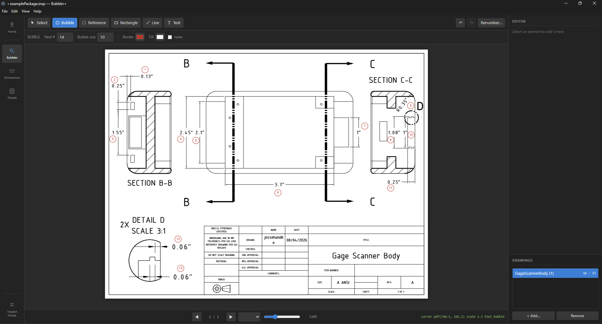
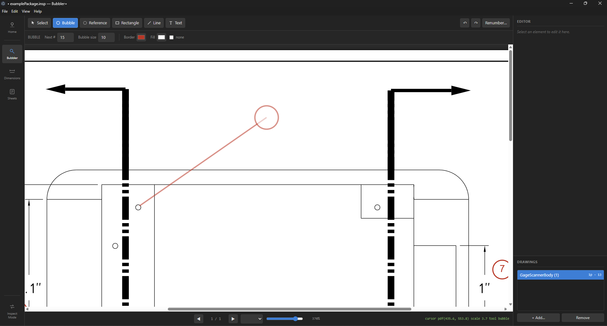
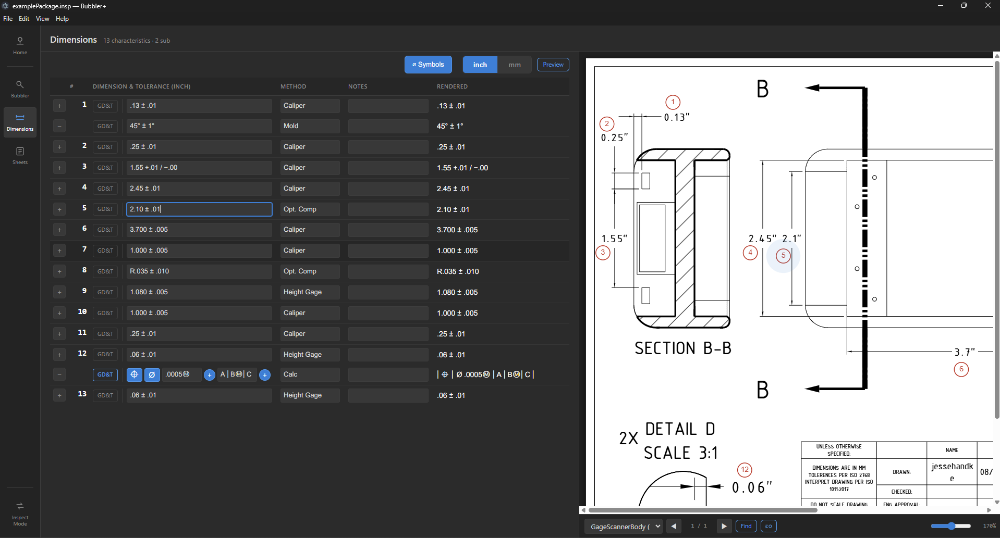
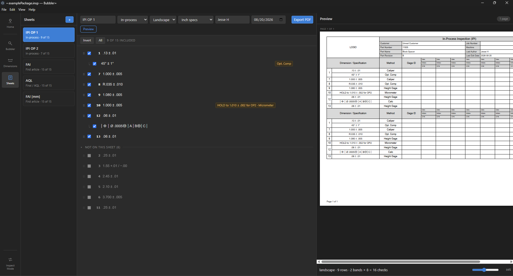
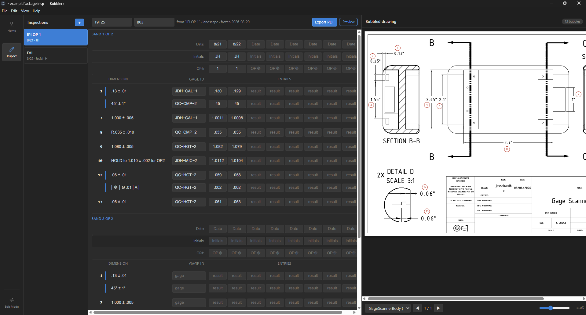
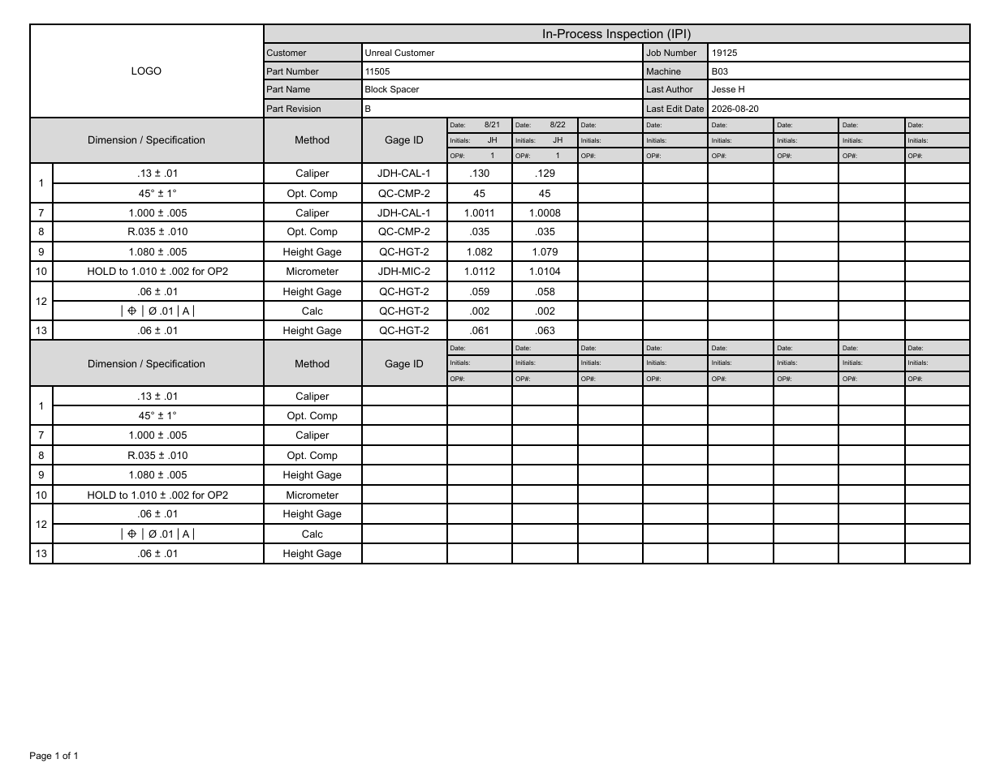

# Bubbler+

### [⬇ Download the latest release](https://github.com/Detalius/bubbler-plus/releases/latest)

Bubble engineering drawings and create inspection paperwork, without a PDF editor or a spreadsheet or a folder of loose files. You can export as pdf, export to Excel workbooks, or print any of your created sheets.

Open a drawing PDF, drop numbered balloons on it, write the dimension for each one, and Bubbler+ keeps the drawing, the dimension list and the inspection sheets together in a single `.insp` file, a *package*, that you can share, archive or hand to whoever runs the part. Be warned: the package contains the actual drawing inside it — put packages ONLY where you would put an actual drawing. When it comes time to inspect, the same package collects the measured values and creates a filled-out record you can then share.

Built for small-shop QC: first article reports, in-process checks, final reports. Packages get indexed for quick searching, without needing to navigate File Explorer.




## What it does

- **Bubble a drawing.** Numbered balloons, reference balloons, leaders, boxes, lines and text notes, over any PDF. Handles multi-page pdfs and can store multiple drawings per package.
- **List the dimensions.** One primary callout per balloon, sub-callouts tied to any balloon, separate lists for inches and millimetres, with a GD&T frame builder for feature control frames.
- **Author inspection sheets.** Pick a sheet type from In-Process, First Article, Multi-Part First Article, or Final. Pick which dimensions go on which sheet, and override dimensions or recommended inspection method for any individual dimension.
- **Record an inspection.** Fill out any sheet you've created with actual numbers. Records snapshot the package as it *was*, so any changes (remove bubbles, add bubbles, fix a mistake) won't appear — if a dimension was wrong, you'll see it in any past records.
- **Find it again.** Packages publish themselves to an index as they are saved, so you can Quick Find a package by part number, part name, customer or file name.
- **Export.** Bubbled drawings, inspection sheets and records as PDF, or the dimension list to Excel.

## Requirements

- Windows 10 or 11.

## Recommendations
- A network share, if several people will use the same package library (like a full QC team). Not required — Bubbler+ works fine entirely on one machine, you'll just need to manually navigate to any packages your app hasn't personally indexed yet.

## Install

1. Download `Bubbler-Plus-Setup-<version>.exe` from the [latest release](https://github.com/Detalius/bubbler-plus/releases/latest).
2. Run it. It installs for the current user, so it needs no administrator rights.
3. Windows will warn that the publisher is unknown, because the installer is not code-signed. Choose **More info** then **Run anyway**.

Updates are handled in-app: see [Updates](#updates) below.

## First-run setup

Bubbler+ runs with no configuration at all. Everything below is about sharing a package library between people — skip it if you are working alone.

Open **File > Settings**.

**Packages root** — the top of the folder tree that will hold your new inspection packages, for example `\\server\Public\Inspection`. Bubbler+ searches below it for package folders. It never writes here except when you save a package into it yourself.

**Package folder** — the folder where `.insp` files live. Defaults to `QC`. This is the folder Bubbler+ looks for when it searches, so set it to whatever your shop uses, or will now use: `Inspection`, `CMM`, anything. As long as the folder name matches what you put in Bubbler+, any number of packages within will be indexed. So, you can keep packages separated by customer/part number...

```
Packages root
└── CUSTOMER
    └── PART NUMBER
        └── QC              ← "Package folder"
            ├── PN-1234_RevB.insp
            └── Archive     ← "Archive folder", superseded revisions
```
Or, you can set up a mega-folder for storing all your packages...
```
Packages root
└── QC
    ├── PN-1234_RevB.insp
    ├── PN-2345_RevA.insp
    ├── PN-3456_RevC.insp
    ├── PN-4567_Rev2.insp
    ├── PN-5678_Rev0.insp
    └── ...
```
The 'mega folder' is recommended, as moving/deleting/renaming files without opening them again renders their index stale, and they will need to either be opened manually, or you will have to rebuild the index, which could take seconds or minutes depending on your share's speed. Create the Packages root and ONLY keep the one single package folder in there and your rebuilds will take only seconds.


**Index folder** — Only configurable when you have a packages root set. This is where the shared search index lives. Every save and open of a package inside the Packages root publishes a small record there, and Quick Find reads those records for fast retrieval. Point every machine at the same index folder and packages root, and everyone searches the same library. Packages saved anywhere else, and everything if you leave this blank, go to the local index in your data folder, on your machine only.

Use **Rebuild index** after setting this up, or any time packages have been moved or deleted outside the app.

## A first package, start to finish

Say you have PN-1234 Rev B to bubble and inspect.

**1. Create it.** From the landing screen > **New**. Fill in the relevant part information.

**2. Bubble the drawing.** On the **Bubbler** page, choose your drawing pdf, then click the balloon tool ('B' is the shortcut) and click to place a balloon. Drag instead of clicking to start drawing a leader line, then release to make the bubble at the ending location. Keep going — the number advances on its own. Hold shift and click to create a reference balloon with the same number as the last real balloon you placed — this does not advance the number, so place as many references as you need. Ctrl+scroll zooms, middle-drag pans, and the strip along the top sets size and color for the next balloon. Right-drag from any tool to box-select.



**3. Write the dimensions.** The **Dimensions** page lists every balloon. Type the callout for each one — `1.250 ±.005`, `Ø.375 ± .002 THRU`, whatever the print says — and press Enter to move to the next. Your bubble print sits beside the table and follows along, so you can read the feature you are typing without having to go hunt for it. Add child dimensions to any primary one — they get the same number on the inspection sheet and are grouped together — useful for chamfers, holes or threads with depths, countersinks/bores, etc. Add measurement method and any notes. For a feature control frame, use the GD&T builder rather than typing symbols by hand. (Currently does not support composite control frames — clarify in notes instead).



**4. Build a sheet.** The **Sheets** page turns those dimensions into an inspection sheet. Add a sheet, select the type (IPI, FAI, etc), change the orientation, units, and sign off as author. Drag rows to reorder. Anything that needs to read differently on this one sheet can be overridden for just this sheet and nothing else.



**5. Save.** Ctrl+S. The package writes as a single `.insp` file — the drawing and everything above, in one file — and publishes itself to the index.

**6. Inspect.** Switch to **Inspect** at the bottom of the left sidebar. Create a new record sheet to fill out from the sheet you built, and enter measured values per piece. Export the record as a PDF. Open it anywhere else, and it's just a pdf. Open it in Bubbler+ and you get your editable record back.





Later, from any machine on the same index: Launcher > **Quick Find**, choose from the list or search using the bar at the top and use the buttons in the top right to print documents, record a new inspection, or edit the package.

## Working with other people

One package is one file, and one file has one editor at a time. When you open a package, Bubbler+ places a small lock file beside it. Anyone else who opens it gets it read-only — they can view, print, export, and save as a new document but they cannot save over your work.

- A lock left behind by a crash expires after a few minutes and is taken over automatically.
- Read-only is not a dead end: **Save As** makes your own copy, and that copy is yours to edit.
- Packages saved by a newer version of Bubbler+ open **view only** in an older one, so an out-of-date machine can still print as much as it can but cannot save the package back in an older shape. Update to edit it.

## Your data folder

Settings, recent files, crash recovery and the local index live in your Roaming AppData folder at:

```
%APPDATA%\Bubbler+
```

**Settings > Open data folder** takes you there. It contains:

| | |
|---|---|
| `config.json` | Everything in the Settings dialog |
| `recents.json` | The recent packages list — paths only |
| `recovery.insp`, `recovery.json` | Autosave of unsaved work, offered back after a crash |
| `.bubbler-index/` | The local search index: every package, or only those outside the Packages root when an Index folder is set |

This folder survives updates and uninstalls. Deleting it resets Bubbler+ to factory settings and touches none of your packages.

## Updates

Bubbler+ checks GitHub for a new release a couple of seconds after it starts, and whenever you use **Help > Check for Updates**. If there is one, a card appears in the corner.

Nothing downloads or installs on its own. Download and Install are both clicks, and installing is refused while you have unsaved work.

## Building from source

```bash
git clone https://github.com/Detalius/bubbler-plus.git
cd bubbler-plus
npm install
npm start           # run it
npm run dist        # build an installer into dist/
npm test            # run the tests (Node 22 or newer)
```

The GD&T symbol font is not yet included in this repository. Without it, feature control frames fall back to a system font on screen and may not export correctly to PDF. Everything else works.

## Reporting bugs

Open an [issue](https://github.com/Detalius/bubbler-plus/issues). What you were doing, what happened, and what you expected instead is plenty. A package that reproduces it helps enormously — strip it of any confidential material first, please.

## License

MIT. See [LICENSE](LICENSE).
